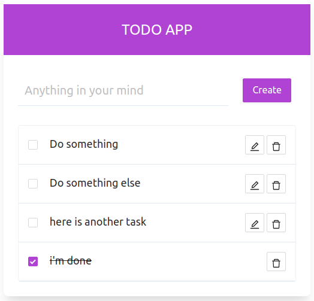

This project was bootstrapped with [Create React App](https://github.com/facebook/create-react-app).

## Available Scripts

In the project directory, you can run:

### `npm start`

Runs the app in the development mode. 
Open [http://localhost:3000](http://localhost:3000) to view it in the browser.

The page will reload if you make edits. 
You will also see any lint errors in the console.

### `npm test`

Launches the test runner in the interactive watch mode. 
See the section about [running tests](https://facebook.github.io/create-react-app/docs/running-tests) for more information.

### `npm run build`

Builds the app for production to the `build` folder. 
It correctly bundles React in production mode and optimizes the build for the best performance.

The build is minified and the filenames include the hashes. 
Your app is ready to be deployed!

See the section about [deployment](https://facebook.github.io/create-react-app/docs/deployment) for more information.

### `npm run eject`

**Note: this is a one-way operation. Once you `eject`, you can’t go back!**

If you aren’t satisfied with the build tool and configuration choices, you can `eject` at any time. This command will remove the single build dependency from your project.

Instead, it will copy all the configuration files and the transitive dependencies (webpack, Babel, ESLint, etc) right into your project so you have full control over them. All of the commands except `eject` will still work, but they will point to the copied scripts so you can tweak them. At this point you’re on your own.

You don’t have to ever use `eject`. The curated feature set is suitable for small and middle deployments, and you shouldn’t feel obligated to use this feature. However we understand that this tool wouldn’t be useful if you couldn’t customize it when you are ready for it.

### `build:css`
Generate tailwind css in to main.css file, Run this if you make any changes to tailwind css

### `storybook`
Run storybook

## Setup guide
Run following commands to init the project

`npm install` 
`npm run build:css` 
`npm start`

## Storybook
Storybook is integrated. All the design system components and todo app components are already added there.

## Architecture
* Front end is React typescript
* Tailwind is the css framework
* Configure tailwind config through `./tailwind.config.js`
* Control components are based on `ant design` library
* Configure ant design style variables through `craco.config.js`
* Most of the components are broken down to atomic components
* Stateless components are used where only rendering matters

## functionality
* Main functionality is managing a todo list
* List items can be added
* Added list items can be marked as done
* List items can be deleted if not needed
* Except done items, others can be edited
* List is sorted by the status of the task (Done items goes to the bottom)

